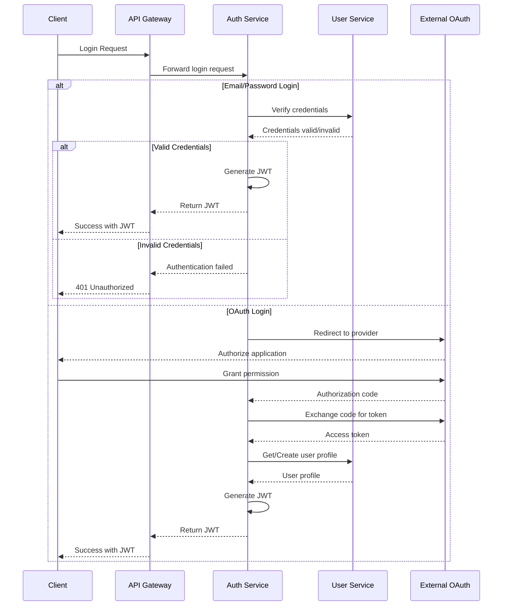
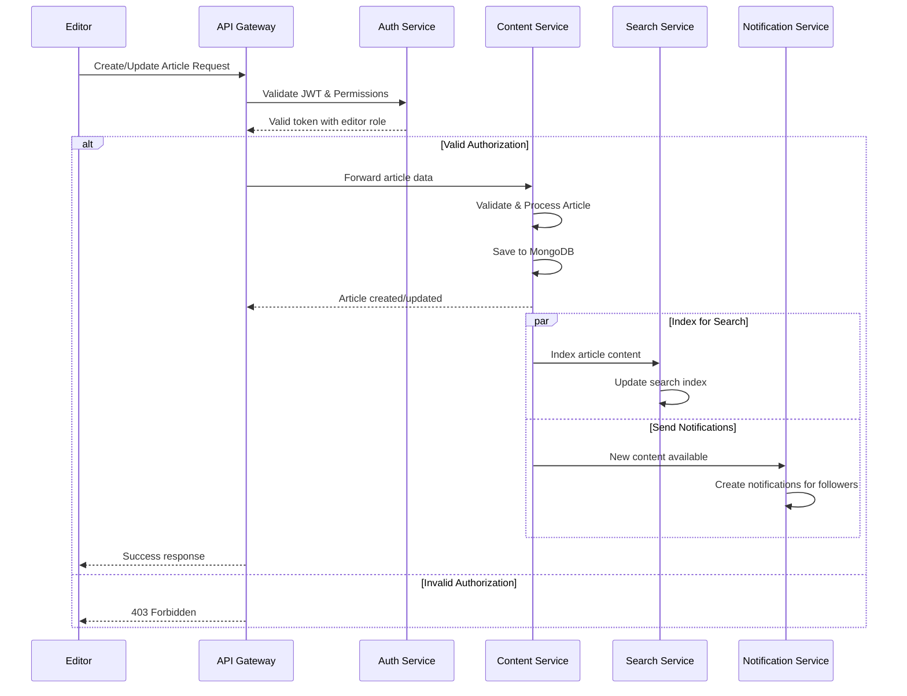
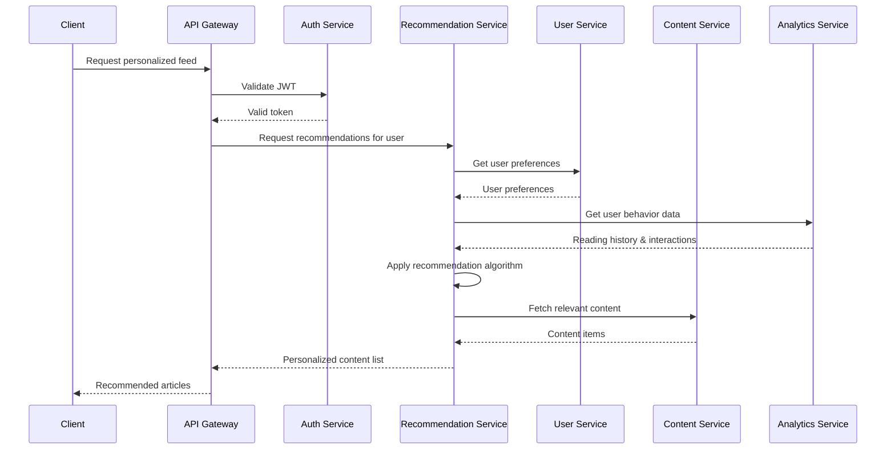
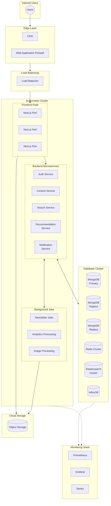

# TechNexus Blog Technology Stack

This document outlines the complete technology stack for implementing the TechNexus Blog platform, including frontend, backend, infrastructure, and third-party integrations.

## System Architecture Overview

```mermaid
flowchart TB
    subgraph ClientLayer["Client Layer"]
        NextApp["Next.js Web Application"]
        MobileWeb["Responsive Mobile Web Interface"]
    end

    subgraph FrontendStack["Frontend Technologies"]
        React["React.js Components"]
        Tailwind["Tailwind CSS"]
        TypeScript["TypeScript"]
        ReactQuery["React Query"]
        Monaco["Monaco Editor (Code Playgrounds)"]
        ChartJS["Chart.js
        (Data Visualization)"]
        FramerMotion["Framer Motion
        (Animations)"]
    end

    subgraph APILayer["API Gateway Layer"]
        APIGateway["API Gateway"]
        GraphQL["Apollo GraphQL"]
        REST["REST API"]
    end

    subgraph BackendServices["Backend Services"]
        AuthService["Authentication
        Service"]
        ContentService["Content
        Service"]
        UserService["User
        Service"]
        SearchService["Search
        Service"]
        AnalyticsService["Analytics
        Service"]
        RecommendationService["Recommendation
        Service"]
        NotificationService["Notification
        Service"]
        InteractionService["Interactive Content
        Service"]
    end

    subgraph BackendStack["Backend Technologies"]
        NodeJS["Node.js"]
        Express["Express.js"]
        ApolloServer["Apollo Server"]
        Mongoose["Mongoose ODM"]
        PassportJS["Passport.js"]
        BullMQ["Bull MQ
        (Job Queue)"]
    end

    subgraph DatabaseLayer["Database Layer"]
        MongoDB[("MongoDB
Content & Users")]
        Elasticsearch[("Elasticsearch
Search Engine")]
        Redis[("Redis
Caching & Sessions")]
        TimeSeriesDB[("InfluxDB
Analytics Time Series")]
    end

    subgraph DeploymentInfra["Deployment & Infrastructure"]
        Docker["Docker Containers"]
        Kubernetes["Kubernetes Orchestration"]
        CICD["CI/CD Pipeline"]
        CloudProvider["Cloud Provider (AWS/GCP/Azure)"]
        CDN["CDN for Assets"]
    end

    subgraph ExternalServices["External Services"]
        EmailService["Transactional Email
        (SendGrid/Mailgun)"]
        AuthProviders["OAuth Providers (Google/GitHub/Instagram/Facebook/X/LinkedIn)"]
        AnalyticsTools["Analytics
        (Google Analytics/Mixpanel)"]
        MonitoringTools["Monitoring
        (DataDog/New Relic)"]
    end

    subgraph DeveloperTools["Developer Tools"]
        ESLint["ESLint"]
        Prettier["Prettier"]
        Jest["Jest"]
        Cypress["Cypress"]
        Storybook["Storybook"]
        Lighthouse["Lighthouse CI"]
    end

    ClientLayer --> FrontendStack
    ClientLayer --> APILayer

    APILayer --> BackendServices
    BackendServices --> BackendStack
    BackendStack --> DatabaseLayer

    BackendServices --> ExternalServices

    DeploymentInfra --> ClientLayer
    DeploymentInfra --> BackendServices
    DeploymentInfra --> DatabaseLayer

    DeveloperTools -.- DeploymentInfra
```

## Frontend Technologies

### Core Libraries

- **Next.js** (v14+): React framework for server-side rendering, static site generation, and API routes
- **React** (v18+): UI component library for building the user interface
- **TypeScript** (v5+): Type-safe JavaScript for better developer experience and fewer bugs
- **Tailwind CSS** (v3+): Utility-first CSS framework for implementing the design system

### State Management & Data Fetching

- **React Query** (v5+): Data fetching, caching, and state management for API data
- **Zustand**: Lightweight state management for global UI state
- **SWR**: React Hooks for data fetching with stale-while-revalidate strategy

### Interactive Components

- **Monaco Editor**: Code editor for interactive coding playgrounds
- **Chart.js** (with React wrapper): Data visualization for articles and interactive content
- **Framer Motion**: Animation library for micro-interactions and transitions
- **React Markdown**: Markdown rendering for article content with custom renderers
- **Prism.js**: Syntax highlighting for code blocks

### Form Management & Validation

- **React Hook Form**: Performance-focused form management
- **Zod**: TypeScript-first schema validation

## Backend Technologies

### Core Framework

- **Node.js** (v18+ LTS): JavaScript runtime for the backend services
- **Express.js**: Web framework for REST API endpoints
- **Apollo Server**: GraphQL implementation for flexible data fetching
- **TypeScript**: Type-safe backend development

### Database & ORM

- **MongoDB**: NoSQL database for content and user data
- **Mongoose**: MongoDB object modeling and ODM
- **Elasticsearch**: Search engine for content discovery
- **Redis**: In-memory data store for caching and real-time features
- **InfluxDB**: Time series database for analytics data

### Authentication & Security

- **Passport.js**: Authentication middleware
- **JWT**: Token-based authentication
- **bcrypt**: Password hashing
- **helmet**: HTTP security headers
- **rate-limiter-flexible**: Rate limiting for API endpoints

### Job Processing

- **Bull MQ**: Redis-based queue for background jobs
- **node-scheduler**: Scheduling recurring tasks

## Infrastructure & DevOps

### Containerization & Orchestration

- **Docker**: Application containerization
- **Kubernetes**: Container orchestration for scaling and management
- **Helm**: Kubernetes package management

### CI/CD Pipeline

- **GitHub Actions** / **GitLab CI**: Automated CI/CD pipeline
- **Jest**: Unit and integration testing
- **Cypress**: End-to-end testing
- **ESLint** / **Prettier**: Code quality and formatting
- **Lighthouse CI**: Performance and accessibility monitoring

### Monitoring & Observability

- **Prometheus**: Metrics collection and alerting
- **Grafana**: Metrics visualization and dashboards
- **Sentry**: Error tracking and monitoring
- **OpenTelemetry**: Distributed tracing

## API Endpoints Integration

### Authentication Flow

### Content Creation & Management Flow

### Personalized Content Recommendation Flow

## Integration Points with Third-party Services

### Email Notifications

- **SendGrid / Mailgun**: For sending transactional emails
  - Newsletter distribution
  - Comment notifications
  - Account management emails

### Authentication Providers

- **Google OAuth**
- **GitHub OAuth**
- **Instagram OAuth**
- **Facebook OAuth**
- **X (formerly Twitter) OAuth**
- **LinkedIn OAuth**

### Analytics & Monitoring

- **Google Analytics**: User behavior tracking
- **Mixpanel**: Event-based user analytics
- **DataDog / New Relic**: Application performance monitoring

### Content Delivery

- **Cloudflare / AWS CloudFront**: CDN for media assets
- **Cloudinary**: Image optimization and transformation
- **AWS S3 / Google Cloud Storage**: Object storage for media

## Deployment Architecture

## Security Implementation

### Authentication & Authorization

- JWT-based authentication with short expiry and refresh tokens
- Role-based access control (RBAC) for content management
- OAuth integration for social logins
- MFA support for critical operations

### Data Protection

- HTTPS enforcement across all communications
- Data encryption at rest for sensitive information
- PII handling in compliance with GDPR and CCPA
- Regular security audits and penetration testing

### API Security

- Rate limiting to prevent abuse
- CORS configuration for proper access control
- Input validation and sanitization
- Prevention of common vulnerabilities (XSS, CSRF, injection)

## Performance Optimization

### Frontend Performance

- Server-side rendering for fast initial load
- Code splitting and lazy loading
- Image optimization with responsive sizing
- Critical CSS inline loading
- Web Vitals monitoring and optimization

### Backend Performance

- Distributed caching with Redis
- Database query optimization
- Connection pooling
- Horizontal scaling of services
- Content pre-generation for common requests

### Content Delivery

- CDN for static assets and media
- Edge caching for frequently accessed content
- Compression (Gzip/Brotli)
- HTTP/2 support
- Optimized asset loading strategy

## Development Workflow

### Local Development

- Docker Compose for local environment setup
- Hot reloading for frontend and backend
- Environment-specific configuration
- Seeded development data

### Testing Strategy

- Unit tests with Jest
- Component tests with React Testing Library
- API tests with Supertest
- End-to-end tests with Cypress
- Performance testing with Lighthouse CI

### CI/CD Workflow

- Branch-based deployments
- Automated testing before merge
- Linting and code quality checks
- Build artifacts versioning
- Blue/green deployment strategy

## Scalability Considerations

### Service Scaling

- Stateless services for easier replication
- Load balancing across service instances
- Database sharding for content distribution
- Read replicas for high-traffic periods

### Content Growth Strategy

- Archiving system for older content
- Dynamic content rendering based on popularity
- Tiered storage for different content types
- Elastic search cluster scaling

### Traffic Management

- Rate limiting and throttling
- Circuit breaking for service protection
- Graceful degradation of non-critical features
- Caching strategies for peak traffic periods
