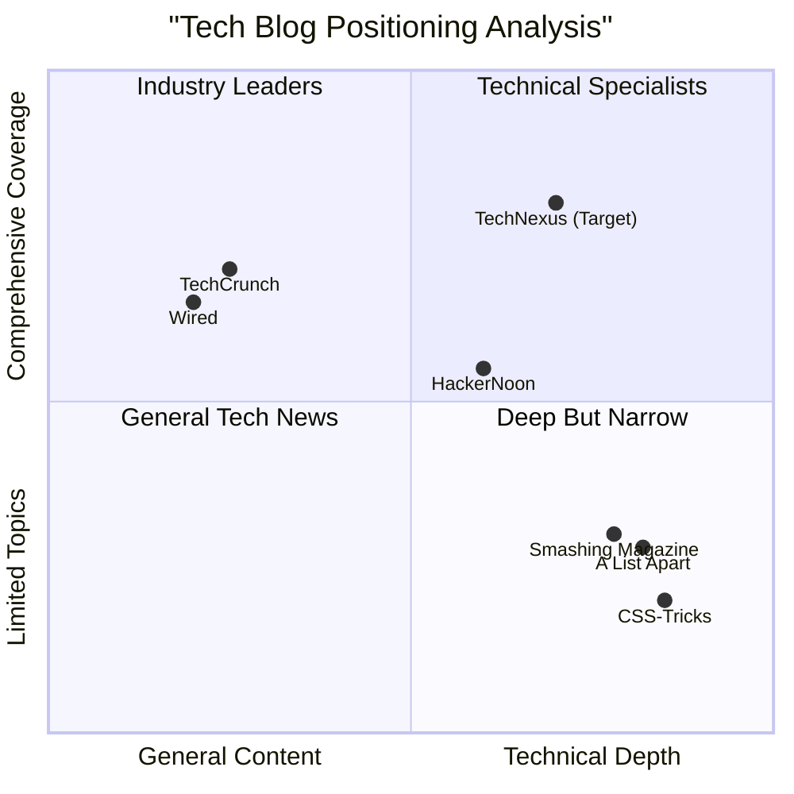

# Product Requirements Document: TechNexus Blog

Date: May 11, 2025

## 1. Executive Summary

TechNexus aims to be a comprehensive, user-centric technology blog platform designed to deliver high-quality content across multiple tech domains. This platform will cater to diverse audience segments including developers, business professionals, and technology enthusiasts by providing specialized content formats tailored to each audience's needs and expertise levels.

The blog will feature an intuitive, modern design with advanced interactive elements, robust categorization, and AI-enhanced personalization. The platform will establish itself as a trusted authority in the technology space through consistent brand voice, expert-driven content, and community engagement features.

### 1.1 Project Goals

1. Create a comprehensive technology content hub that successfully serves multiple audience segments with specialized content formats and delivery mechanisms
2. Establish a distinctive brand voice and content strategy that builds authority and trust in the technology community
3. Implement an advanced, user-friendly platform architecture that supports diverse content types and interactive features while maintaining excellent performance metrics

### 1.2 Original Requirements

Develop a tech blog with:

- Consistent content style and brand voice
- Wireframe prototype with intuitive navigation
- Defined branding elements (fonts and colors)
- Front-end and back-end development specifications
- Main technology categories: AI/ML, Cybersecurity, Web Development, Cloud Computing, Gaming/Consumer Tech, and Emerging Technologies

## 2. Target Audience Analysis

### 2.1 Primary Audience Segments

#### 2.1.1 Developers & Technical Professionals

- **Characteristics**: Software engineers, data scientists, cybersecurity specialists, DevOps engineers, and other technical practitioners
- **Technical Proficiency**: High
- **Content Preferences**: Code samples, technical deep-dives, implementation guides, API documentation, practical solutions
- **Motivation**: Professional development, problem-solving, staying current with technical advancements

#### 2.1.2 Business Professionals

- **Characteristics**: CTOs, IT managers, technology decision-makers, consultants, and business leaders
- **Technical Proficiency**: Medium to high conceptual understanding, but may lack deep technical knowledge
- **Content Preferences**: Case studies, ROI analysis, strategic overviews, market trends, implementation strategies
- **Motivation**: Making informed business decisions, understanding tech implications for business, competitive advantage

#### 2.1.3 Technology Enthusiasts & Beginners

- **Characteristics**: Students, career-switchers, hobbyists, and consumers interested in technology
- **Technical Proficiency**: Beginner to intermediate
- **Content Preferences**: Tutorials, explainers, glossaries, visual guides, product reviews
- **Motivation**: Learning, exploration, practical application of technology concepts

### 2.2 User Personas

#### Persona 1: Developer Dana

- **Role**: Senior Software Engineer at a mid-sized tech company
- **Technical Expertise**: Advanced
- **Goals**: Find practical, code-focused solutions to specific problems; stay updated on emerging technologies; expand technical skill set
- **Challenges**: Limited time; requires credible, technically accurate content; needs comprehensive code samples and implementation details
- **Content Consumption**: Primarily desktop during work hours; focuses on technical categories and code repositories

#### Persona 2: Manager Michael

- **Role**: IT Director at a financial services firm
- **Technical Expertise**: Moderate (conceptual understanding but not a daily practitioner)
- **Goals**: Evaluate new technologies for business implementation; understand security implications; make informed investment decisions
- **Challenges**: Bridging technical concepts with business value; communicating technical needs to non-technical stakeholders
- **Content Consumption**: Mix of mobile and desktop; interested in executive summaries, case studies, and strategic analysis

#### Persona 3: Beginner Beth

- **Role**: Marketing professional exploring tech career transition
- **Technical Expertise**: Novice
- **Goals**: Build foundational knowledge; learn practical skills; understand tech terminology
- **Challenges**: Technical jargon; steep learning curves; finding approachable content
- **Content Consumption**: Primarily mobile device; prefers video tutorials, step-by-step guides, and visual explanations

## 3. Brand Strategy & Content Voice

### 3.1 Brand Positioning

TechNexus will position itself as an authoritative yet approachable technology resource that bridges the gap between technical depth and practical application. The brand will be recognized for:

- Trustworthy, fact-based content with rigorous editorial standards
- Inclusive approach that serves multiple audience segments without compromising depth
- Forward-thinking perspective that anticipates technology trends
- Community-oriented ethos that encourages dialogue and participation

### 3.2 Brand Voice & Tone Guidelines

#### Core Voice Attributes

1. **Expert but Accessible**
    - Use technical terminology appropriately but provide context
    - Avoid unnecessary jargon when simple language suffices
    - When complex topics are discussed, include appropriate explanations or links to reference material
2. **Clear and Precise**
    - Prioritize clarity in explanations
    - Use concrete examples rather than abstract concepts
    - Be specific and detail-oriented, especially in technical content
3. **Engaging and Conversational**
    - Address the reader directly using "you" where appropriate
    - Ask thoughtful questions that prompt reflection
    - Use active voice and maintain a conversational flow
4. **Forward-thinking and Innovative**
    - Present emerging trends with balanced perspective
    - Challenge conventional thinking when appropriate
    - Connect technological developments to broader implications

#### Tone Variations by Audience

- **For Developers**: More technical, direct, and detailed
- **For Business Professionals**: Strategically focused, emphasizing value and implementation
- **For Beginners**: More explanatory, encouraging, and foundational

### 3.3 Content Principles

1. **Accuracy is Non-negotiable**
    - All technical information must be verified and current
    - Code examples must be tested and functional
    - Claims must be supported by credible sources
2. **Depth with Accessibility**
    - Layer content to serve multiple expertise levels
    - Provide progressive disclosure through expandable sections
    - Include both quick takeaways and in-depth analysis
3. **Visual Communication**
    - Use diagrams, flowcharts, and illustrations to explain complex concepts
    - Include relevant screenshots and visual aids
    - Implement consistent data visualization standards
4. **Actionable Value**
    - Every piece of content should have clear practical applications
    - Include next steps or implementation guidance
    - Provide resources for further learning or application

## 4. Blog Structure & Navigation

### 4.1 Information Architecture

#### Main Navigation Categories (Top Level)

- These categories will serve as primary navigation items. On desktop, hovering or clicking may reveal dropdowns with sub-categories and/or article previews. On mobile, they will be expandable sections within the hamburger menu.
  1. **Artificial Intelligence & Machine Learning**
      - Natural Language Processing
      - Generative AI
      - Computer Vision
      - Edge AI & IoT
      - Ethical AI & Explainable AI
  2. **Cybersecurity**
      - Financial Sector Security
      - IoT & Mobile Security
      - AI-Driven Cyber Defense
      - Privacy & Data Protection
      - Threat Intelligence
  3. **Web Development**
      - Front-End & UI Design
      - Back-End & API Integration
      - Performance Optimization
      - Web Frameworks & Libraries
      - Accessibility & Standards
  4. **Mobile App Development**
      - iOS Development
      - Android Development
      - Cross-Platform Frameworks
      - Mobile UX Design
      - App Performance & Testing
  5. **Cloud Computing & Infrastructure**
      - IaaS & PaaS Solutions
      - Serverless Computing & Microservices
      - Cloud Security & Compliance
      - Containerization & Orchestration
      - Multi-Cloud Strategies
  6. **Gaming Technology**
      - Game Engines & Development
      - Graphics & Animation
      - Gaming Hardware
      - AR/VR in Gaming
      - Game AI & Procedural Generation
  7. **Consumer Electronics**
      - Smartphones & Wearables
      - Smart Home Technology
      - Audio & Visual Equipment
      - Productivity Devices
      - Consumer Tech Reviews
  8. **Emerging Technologies**
      - Digital Twins
      - Quantum Computing
      - Blockchain Applications
      - Biotechnology & Tech Convergence
      - Sustainable Tech Innovations
- Newsletter Subscription link (triggers modal/dedicated section view)

#### Sub-Category Navigation

Within each main category, allow for navigation to more specific sub-topics. These could be presented as dropdowns from the main navigation (desktop) or nested lists (mobile), potentially with visual previews of representative articles for each sub-category or main category.

### 4.2 Secondary Navigation Elements

#### Expertise Level Filters

- Beginner
- Intermediate
- Advanced

#### Content Format Filters

- Articles & Deep Dives
- Tutorials & How-Tos
- Case Studies
- Videos & Webinars
- Interactive Tools

#### Search Functionality

- AI-powered search with natural language understanding
- Filters for content type, category, and expertise level
- Recent searches and personalized recommendations

### 4.3 User Journey Mapping

#### Homepage Journey

- Featured content spotlight (rotates based on popularity/recency)
- Category quick-links with visual identifiers
- Personalized recommendations section (for returning users)
- Latest articles across categories
- User sees a clear call-to-action for newsletter sign-up (e.g., dedicated section on homepage, and accessible via header/menu).

#### Category Page Journey

- Category overview and importance
- Featured/trending content in that category
- Sub-category navigation
- Content organized by format type
- Related categories suggestion

#### Article Page Journey

- Estimated reading time
- Table of contents for longer articles
- Expertise level indicator
- Interactive elements (where applicable)
- Related content recommendations
- Author information and credentials
- Social sharing options
- Comment/discussion section

## 5. Content Strategy & Formats

### 5.1 Content Types by Audience Segment

#### For Developers & Technical Professionals

**MUST HAVE:**

- Technical tutorials with complete code samples
- Technical deep-dives with implementation details
- API and integration guides
- Performance optimization techniques
- Security best practices

**SHOULD HAVE:**

- Tool comparisons and benchmarks
- Code quality and testing guides
- Architecture design patterns
- Technical webinars and expert sessions
- Open source contribution guides

**MAY HAVE:**

- Technical community spotlights
- Career development resources
- Legacy system modernization approaches

#### For Business Professionals

**MUST HAVE:**

- Technology implementation case studies
- ROI analyses and business value assessments
- Strategic technology adoption guides
- Risk and compliance overviews
- Market trend analyses

**SHOULD HAVE:**

- Executive briefings on technical topics
- Digital transformation frameworks
- Technology investment guidelines
- Competitive landscape analyses
- Change management strategies for tech adoption

**MAY HAVE:**

- CTO/CIO interview series
- Industry-specific technology applications
- Predictive trend forecasting

#### For Technology Enthusiasts & Beginners

**MUST HAVE:**

- Beginner-friendly tutorials with step-by-step instructions
- Technology concept explainers
- Glossaries and terminology guides
- Getting started guides for various technologies
- Visual learning resources

**SHOULD HAVE:**

- Interactive learning modules
- Technology career pathways
- Practical projects for skill building
- Tool setup and environment guides
- FAQ compilations for common challenges

**MAY HAVE:**

- Tech history and evolution timelines
- Inspirational tech applications
- Beginner showcase opportunities

### 5.2 Content Formats & Templates

#### Article Templates

1. **Technical Tutorial Template**
    - Prerequisites section
    - Objective statement
    - Materials/tools needed
    - Step-by-step instructions with code blocks
    - Expected outcomes/results
    - Troubleshooting section
    - Next steps and further resources
2. **Case Study Template**
    - Challenge summary
    - Company/organization context
    - Approach and methodology
    - Implementation details
    - Results and metrics
    - Lessons learned
    - Applicability to other scenarios
3. **Explainer Article Template**
    - Concept introduction
    - Historical context (when relevant)
    - Key components breakdown
    - Visual explanation
    - Real-world applications
    - Future implications
    - Further learning resources
4. **Product Review Template**
    - Specifications overview
    - Testing methodology
    - Performance results
    - Comparison with alternatives
    - Pros and cons analysis
    - User experience evaluation
    - Value assessment and recommendation
5. **Technical Deep-Dive Template**
    - Problem statement
    - Technical background
    - Multiple approach analysis
    - Detailed implementation
    - Performance considerations
    - Edge cases and limitations
    - Advanced techniques

#### Interactive Content Types

1. **Code Playgrounds**
    - Interactive code editors for multiple languages
    - Pre-populated examples that can be modified
    - Save and share functionality
    - Output visualization
2. **Decision Trees**
    - Interactive flowcharts for technology selection
    - Requirement-based filtering
    - Comparative outcome views
3. **Interactive Infographics**
    - Data-driven visualizations
    - User-controlled filtering and views
    - Animation to demonstrate processes or changes
4. **Assessment Tools**
    - Knowledge quizzes
    - Technology readiness evaluations
    - Skill gap analyses
5. **Interactive Tutorials**
    - Step-by-step guided experiences
    - Progress tracking
    - Checkpoint validations

### 5.3 Content Production Standards

#### Technical Accuracy Requirements

- All code must be tested in appropriate environments
- Technical claims must be verified by subject matter experts
- Version information must be clearly specified for all technologies discussed
- Updates must be applied when technology versions change significantly
- Limitations and edge cases must be documented

#### Visual Content Standards

- Diagrams must follow consistent design patterns
- Screenshots must be high resolution and annotated where needed
- Videos must include captions and transcripts
- Color choices must meet accessibility standards
- Complex visual elements must include alternative text descriptions

#### Editorial Workflow

1. Content planning based on audience needs and trending topics
2. Subject matter expert assignment
3. Initial draft creation
4. Technical review
5. Editorial review for style and brand voice
6. Accessibility check
7. Publishing with appropriate categorization and metadata
8. Promotion across channels
9. Performance monitoring
10. Periodic content refresh assessment

## 6. Technical Requirements

### 6.1 Platform Architecture

#### Core Technical Components

- **API-First Architecture**: Headless CMS with API-driven frontend for maximum flexibility
- **Microservices Approach**: Separate services for content management, user authentication, search, and analytics
- **Serverless Backend**: Utilize serverless functions for scalability and cost efficiency
- **Modern Frontend Framework**: React.js with Next.js for server-side rendering and optimal performance
- **Mobile-First Responsive Design**: Ensure perfect rendering across all device types

#### Data Management

- **Content Database**: NoSQL database for flexible content schema
- **User Data Store**: Secure, compliant storage for user preferences and behavior
- **Analytics Database**: Time-series database for performance and usage metrics
- **Search Engine**: Elasticsearch or similar for advanced content discovery
- **Media Asset Management**: CDN-backed storage for images, videos, and other media

#### Third-party Integrations

- **Authentication Services**: OAuth providers and SSO options
- **Payment Processing**: For premium content features (if applicable)
- **Email Marketing Platform**: For newsletter distribution and alerts
- **Social Media APIs**: For content sharing and embedding
- **Analytics Platforms**: For comprehensive performance tracking

### 6.2 Frontend Development Requirements

#### User Interface Components

- **Design System**: Comprehensive component library with consistent styling
- **Responsive Grid**: Flexible layout system that adapts to all screen sizes
- **Navigation Components**: Header, footer, sidebar, and mobile navigation
- **Content Display Components**: Article layouts, code blocks, media embeds
- **Interactive Components**: Comments, ratings, sharing tools, progress indicators

#### Performance Requirements

- **Core Web Vitals Compliance**: Meet all Google Core Web Vitals thresholds
  - Largest Contentful Paint (LCP): < 2.5 seconds
  - First Input Delay (FID): < 100 milliseconds
  - Cumulative Layout Shift (CLS): < 0.1
- **Page Load Performance**: Initial page load < 2 seconds on broadband connections
- **Mobile Optimization**: Optimized assets for various connection speeds
- **Progressive Enhancement**: Core functionality works without JavaScript

#### Accessibility Standards

- **WCAG 2.2 Compliance**: Meet AA level compliance across all pages
- **Keyboard Navigation**: Full functionality available without mouse
- **Screen Reader Compatibility**: Proper ARIA attributes and semantic HTML
- **Color Contrast**: Meet minimum contrast ratios for all text
- **Focus Management**: Visible focus indicators for all interactive elements

### 6.3 Backend Development Requirements

#### API Requirements

- **RESTful Endpoints**: Well-documented API with consistent patterns
- **GraphQL Support**: For flexible data fetching and reduced over-fetching
- **Authentication**: JWT-based authentication with proper security measures
- **Rate Limiting**: Protect against abuse and ensure fair resource allocation
- **Caching Strategy**: Implement appropriate caching headers and mechanisms

#### Content Management Requirements

- **Rich Text Editing**: Advanced editor with code formatting support
- **Version Control**: Content versioning and rollback capabilities
- **Workflow Management**: Draft, review, and publishing workflows
- **Scheduled Publishing**: Time-based content release
- **Multi-format Support**: Handle various content types (text, video, interactive)

#### Security Requirements

- **HTTPS Enforcement**: TLS encryption for all connections
- **Content Security Policy**: Prevent XSS and other injection attacks
- **Data Protection**: Encryption for sensitive user data
- **Authentication Security**: Secure password handling, MFA support
- **Regular Security Audits**: Scheduled vulnerability assessments

## 7. User Experience & Design

### 7.1 Design System (Brief Overview - Full details in `TechNexus_Blog_design_system.md`)

- **Navigation**: Intuitive and clear navigation structure. Main categories easily accessible, with enhanced discoverability through dropdowns/previews for sub-categories.
- **Layout**: Responsive design for optimal viewing on all devices (desktop, tablet, mobile). Clean, uncluttered layouts.
- **Typography**: Readable and modern fonts. Clear hierarchy for headings and body text.
- **Color Palette**: Defined primary, secondary, accent, and neutral colors (see `TechNexus_Blog_design_system.md`).
- **Iconography**: Consistent icon set for UI elements and actions.
- **Accessibility**: Design choices adhere to WCAG 2.2 AA standards.

#### Brand Color Palette

- **Primary Colors**:
  - Primary Blue: #2563EB
  - Secondary Teal: #0D9488
  - Accent Orange: #F97316
- **Neutral Colors**:
  - Dark: #1E293B
  - Medium: #64748B
  - Light: #F1F5F9
  - White: #FFFFFF
- **Semantic Colors**:
  - Success: #10B981
  - Warning: #F59E0B
  - Error: #EF4444
  - Info: #3B82F6

#### Typography

- **Primary Font**: Inter (Sans-serif)
  - Headings, UI elements, body text
  - Weights: 400 (regular), 500 (medium), 600 (semibold), 700 (bold)
- **Monospace Font**: JetBrains Mono
  - Code blocks, technical specifications
  - Weights: 400 (regular), 700 (bold)
- **Font Sizing**:
  - Base size: 16px
  - Scale: 1.250 (major third) typographic scale
  - Fluid typography for responsive sizing

#### UI Components

- **Buttons**:
  - Primary: Filled background, white text
  - Secondary: Outlined, colored text
  - Tertiary: Text-only with hover effect
  - Icon buttons for compact actions
- **Cards**:
  - Content cards with consistent padding
  - Interactive hover states
  - Optional featured/highlighted variations
- **Navigation**:
  - Consistent header with responsive behavior
  - Category-based main navigation
  - Breadcrumb navigation for deep content
- **Form Elements**:
  - Accessible input styling
  - Clear validation states
  - Progressive disclosure when appropriate

### 7.2 Key UI Components (Brief Overview - Full details in `TechNexus_Blog_UI_mockups.md` and `TechNexus_Blog_system_design.md`)

- **Header**:
  - **Logo**: Prominently displayed, top-left.
  - **Main Navigation Menu**: Links to main TechNexus categories. Dropdown menus for categories will reveal sub-categories and potentially article previews (image + title) on desktop. Includes Newsletter Subscription button (triggers modal/dedicated section view).
  - **Search Icon/Bar**: Clearly visible search functionality.
  - **User Authentication Area**: "Login/Sign Up" buttons if the user is not authenticated, or preferably, a user account icon if authenticated (leading to Profile, Settings, Saved Articles, Logout).
  - **Dark Mode Toggle**: Easily accessible.
- **Footer**:
  - **Layout**: Multi-column layout.
  - **Content Blocks (Examples)**:
    - About Us: Brief description of TechNexus Blog.
    - Quick Links/Navigation: Important site links (e.g., categories, About, Contact).
    - Recent Posts/Popular Posts (Optional): Links to recent or popular articles.
    - Tags/Categories Cloud (Optional): Visual representation of popular tags or categories.
  - **Contact Information**: Email.
  - **Social Media Integration**: Prominently displayed icons linking to GitHub, Instagram, Facebook, X, LinkedIn, & Email.
  - **Copyright Information**: Standard copyright notice and year.
  - **Back to Top Button** (Optional but good UX).
- **Homepage**:
  - **Layout**: Dynamic and engaging, inspired by modern tech blogs and magazine layouts.
  - **Hero Section**: Large featured article or a slider/carousel of top stories with high-quality imagery and clear headlines.
  - **Featured Articles Grid/List**: Showcase several important articles below the hero section.
  - **Category Showcases**: Dedicated sections for key content categories (e.g., "Latest in Technology," "Cybersecurity Highlights") using various layouts like grids, lists with thumbnails, or carousels.
  - **Popular Posts/Trending Section**: Display articles based on popularity (e.g., views, comments).
  - **Newsletter CTA**: Clearly visible call-to-action for newsletter sign-up.
- **Newsletter Subscription**: Accessible via header button and menu link, presenting a modal or dedicated view for sign-up, potentially with category interest selection.
- **Article Page**:
  - Title, Author, Date, Content, Social Share, Comments, Related Articles.
  - **Featured Image/Video**: High-quality media at the top.
  - **Social Sharing Buttons**: Easy access for sharing.
  - **Expertise Level Indicator**: Clearly displayed.
  - **Table of Contents**: For longer articles.
  - **Author Bio Section**: Brief information about the author.
  - **Related Learning Path Progress**: Indicator for logged-in users.
- **Category/Search Results Page**:
  - List of articles with excerpts, filtering/sorting options.
  - **Article Listing Formats**: Options include grid layout with thumbnails and excerpts, list layout with larger thumbnails, or a combination.
  - **Pagination**: Clear pagination.
  - **Sidebar (Optional)**: Could include widgets like popular posts in the category, category list, or tags. (Advertisements are not currently in scope).
  - **Category Description**: A brief description of the category at the top.
- **User Profile Page**: User details, saved articles, reading history, preferences.
- **"Top Picks" Section**:
  - **Placement**: Positioned above the main footer on the homepage or relevant landing pages.
  - **Content**: Curated list of articles deemed as "Top Picks," manually selected or dynamically generated.
  - **Display Style**: Visually distinct using a carousel, a uniquely styled grid, or a list format to draw user attention.

### 7.3 Interaction Design

#### Micro-interactions

- **Hover States**: Subtle feedback on interactive elements
- **Loading States**: Skeleton screens rather than spinners where possible
- **Transitions**: Smooth transitions between states and pages
- **Feedback Animations**: Visual confirmation of user actions
- **Scroll Behavior**: Smooth scrolling with lazy-loading content

#### Navigation Patterns

- **Main Navigation**: Expandable categories with visual indicators
- **Mobile Navigation**: Off-canvas menu with intuitive gestures
- **In-Page Navigation**: Table of contents for long-form content
- **Search Experience**: Predictive search with categorized results
- **Related Content**: Contextual recommendations within content flow

### 7.4 Mobile Experience

#### Mobile-Specific Considerations

- **Touch Targets**: Minimum 44x44px for all interactive elements
- **Gesture Support**: Swipe navigation for content carousels
- **Offline Support**: Progressive web app functionality for core features
- **Data Usage Optimization**: Optional low-bandwidth mode
- **Mobile Reading Experience**: Optimized typography and spacing

### 7.5 Personalization Features

- **Content Recommendations**: Based on reading history and preferences
- **Saved Content**: Bookmarking functionality for later reading
- **Reading History**: Easily access previously viewed content
- **Preferences Management**: User-controlled content filtering
- **Notification Settings**: Customizable alerts for new relevant content

## 8. Interactive Features & Engagement

### 8.1 Community Features

#### Discussion & Comments

- **Threaded Comments**: Organized conversation flows
- **Code Sharing**: Formatted code blocks in comments
- **Moderation Tools**: Community guidelines enforcement
- **User Reputation**: Recognition for valuable contributions
- **Expert Highlighting**: Visual indicators for staff and expert contributors

#### User Contributions

- **Guest Posts**: Submission process for community content
- **Success Stories**: User implementation showcases
- **Resource Sharing**: Community-contributed resources
- **Question & Answer**: Structured Q&A format for specific topics
- **Feedback Mechanisms**: Feature requests and content suggestions

### 8.2 Learning & Skill Development

- **Learning Paths**: Curated content sequences for skill development
- **Progress Tracking**: User advancement through learning content
- **Skill Assessments**: Optional knowledge checks
- **Certificates**: Completion recognition for comprehensive modules
- **Resource Collections**: Downloadable supplementary materials

### 8.3 Interactive Content Features

- **Live Code Editors**: In-browser code execution
- **Interactive Diagrams**: Manipulatable technical illustrations
- **Tool Calculators**: Interactive decision-making tools
- **AR/VR Content**: Immersive explanations for complex concepts
- **Interactive Tutorials**: Guided, hands-on learning experiences

### 8.4 Content Discovery Features

- **Advanced Search**: Faceted search with multiple parameters
- **Content Collections**: Curated groups of related articles
- **Trending Topics**: Real-time popularity indicators
- **Recommendation Engine**: Personalized content suggestions
- **New Technology Radar**: Emerging technology tracker

## 9. Success Metrics & KPIs

### 9.1 Engagement Metrics

- **Average Time on Page**: Target: >3 minutes for articles
- **Pages per Session**: Target: >1.8 pages
- **Bounce Rate**: Target: <40% for non-reference content
- **Scroll Depth**: Target: >70% average content consumption
- **Return Visitor Rate**: Target: >40% monthly return rate

### 9.2 Growth Metrics

- **Monthly Active Users (MAU)**: 10% month-over-month growth
- **Subscriber Growth Rate**: 15% month-over-month growth
- **Social Share Count**: Average 50+ shares per featured article
- **Organic Traffic Growth**: 20% quarter-over-quarter growth
- **Referral Traffic**: 15% of total traffic from community referrals

### 9.3 Content Performance Metrics

- **Content Relevancy Score**: Based on user engagement patterns
- **Search Visibility**: Ranking for target keywords
- **Content Freshness Index**: Percentage of recently updated content
- **Format Effectiveness**: Comparative performance of different content types
- **Topic Performance**: Engagement trends by subject area

### 9.4 Technical Performance Metrics

- **Page Load Time**: Average < 2 seconds
- **Mobile Usability Score**: 100% compliance with mobile usability standards
- **Accessibility Compliance**: 100% WCAG 2.2 AA compliance
- **Core Web Vitals**: Meet or exceed all thresholds
- **API Response Time**: Average < 300ms

### 9.5 Business Impact Metrics

- **Conversion Rate**: For newsletter signups and premium features
- **Cost per Acquisition**: Efficiency of marketing spend
- **Customer Lifetime Value**: For monetization strategies
- **Brand Authority Growth**: Industry citations and backlinks
- **Partnership Opportunities**: Generated through content visibility

## 10. Implementation Roadmap

### 10.1 Phase 1: Foundation (Months 1-2)

- Platform architecture design and setup
- Core brand identity implementation
- Basic content management system integration
- Essential content templates creation
- Initial category structure implementation

### 10.2 Phase 2: Core Experience (Months 3-4)

- Complete navigation and information architecture
- Responsive design implementation across device types
- Basic search functionality
- Initial content library development (25+ articles)
- User account creation and preferences

### 10.3 Phase 3: Enhanced Features (Months 5-6)

- Interactive content capabilities
- Advanced search and discovery features
- Community features and commenting system
- Personalization engine integration
- Performance optimization

### 10.4 Phase 4: Growth & Refinement (Months 7-9)

- Analytics integration and dashboard development
- A/B testing framework implementation
- Content recommendation engine refinement
- Advanced personalization features
- SEO optimization and structured data implementation

## 11. Open Questions & Considerations

1. **Monetization Strategy**: Should we implement premium content or membership models in future phases?
2. **Content Localization**: What is the priority for supporting multiple languages?
3. **Mobile App Development**: Should a dedicated mobile application be considered after web platform establishment?
4. **AI Content Creation**: What guidelines should be established for AI-assisted content development?
5. **User-Generated Content**: What moderation resources will be required as the community grows?
6. **Content Freshness**: What process should be implemented for regular content audits and updates?
7. **Partnership Strategy**: Which technology providers should be approached for expert content collaboration?
8. **"Top Picks" Curation Strategy**: How will "Top Picks" be selected or dynamically generated? What are the criteria?

### 11.1 Clarified Items (Summary from Magazine Style Focus)

- The overall UI/UX will draw inspiration from modern magazine layouts for structure and engagement, particularly for the homepage, article presentation, and footer.
- The "Top Picks" section is a confirmed feature to be prominently displayed.
- Header and Footer design will incorporate elements typical of well-structured magazine sites, adapted to the TechNexus brand.

## 12. Appendices

### 12.1 Competitive Analysis

### 12.2 User Journey Maps

#### Developer Journey

1. **Discovery**: Organic search for specific technical solution
2. **Entry Point**: Technical tutorial article
3. **Engagement**: Reviews code examples, tries implementation
4. **Deeper Exploration**: Explores related articles in same category
5. **Conversion**: Subscribes to category updates
6. **Retention**: Returns for new technical content, eventually participates in discussions

#### Business Professional Journey

1. **Discovery**: LinkedIn share or newsletter
2. **Entry Point**: Technology trend analysis
3. **Engagement**: Reviews business implications section
4. **Deeper Exploration**: Reads related case study
5. **Conversion**: Downloads supplementary resources
6. **Retention**: Returns for strategic insights, shares content with team

#### Beginner Journey

1. **Discovery**: Google search for explanatory content
2. **Entry Point**: "What is X" explainer article
3. **Engagement**: Follows embedded links to terminology
4. **Deeper Exploration**: Explores beginner tutorial on topic
5. **Conversion**: Saves article and follows suggested learning path
6. **Retention**: Returns to continue learning path, subscribes to newsletter

### 12.3 Wireframe Prototype Guidelines

- Homepage layout with featured content blocks
- Category page template with filtering options
- Article page templates for different content types
- Mobile navigation pattern
- Search results presentation
- User profile and preferences screens

End of Product Requirements Document
